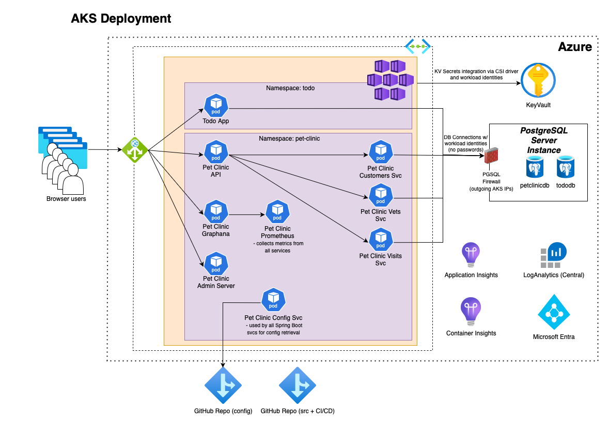

# Spring Boot Todo App and Pet Clinic App on Azure Kubernetes Service (AKS)

## Deploying Todo App and Pet Clinic App into an AKS using az CLI, Azure Bicep template and kubectl



* Start the command line, clone the repo using ```git clone https://github.com/martinabrle/aks-java-demo.git``` and change your current directory to ```aks-java-demo/scripts``` directory:
    ```
    cd ./aks-java-demo/scripts
    ```
* Log in into Azure from the command line using ```az login``` ([link](https://docs.microsoft.com/en-us/cli/azure/authenticate-azure-cli))
* List available Azure subscriptions using ```az account list -o table``` ([link](https://docs.microsoft.com/en-us/cli/azure/account#az-account-list))
* Select an Azure subscription to deploy the infra into, using ```az account set -s 00000000-0000-0000-0000-000000000000```
  ([link](https://docs.microsoft.com/en-us/cli/azure/account#az-account-set)); replace ```00000000-0000-0000-0000-000000000000``` with Azure subscription Id you will deploy into
* Set environment variables:
    ```
    AZURE_LOCATION="eastus"
    LOG_ANALYTICS_WRKSPC_NAME="{{{REPLACE_WITH_LOG_WORKSPACE_NAME}}}"
    LOG_ANALYTICS_WRKSPC_SUBSCRIPTION_ID="{{{REPLACE_WITH_LOG_WORKSPACE_SUBSCRIPTION_ID}}}"
    LOG_ANALYTICS_WRKSPC_RESOURCE_GROUP="{{{REPLACE_WITH_LOG_WORKSPACE_RESOURCE_GROUP}}}"
    LOG_ANALYTICS_WRKSPC_RESOURCE_TAGS='{ \"Department\": \"RESEARCH\", \"CostCentre\": \"DEV\", \"DeleteNightly\": \"true\",  \"DeleteWeekly\": \"true\", \"Architecture\": \"LOG-ANALYTICS\"}'
    
    PGSQL_NAME="{{{REPLACE_WITH_PGSQL_NAME}}}"
    PGSQL_SUBSCRIPTION_ID="{{{REPLACE_WITH_PGSQL_SUBSCRIPTION_ID}}}"
    PGSQL_RESOURCE_GROUP="{{{REPLACE_WITH_PGSQL_RESOURCE_GROUP}}}"
    PGSQL_RESOURCE_TAGS='{ \"Department\": \"RESEARCH\", \"CostCentre\": \"DEV\", \"DeleteNightly\": \"false\",  \"DeleteWeekly\": \"false\", \"Architecture\": \"PGSQL\"}'

    APP_SERVICE_NAME="{{{REPLACE_WITH_APP_SERVICE_NAME}}}"
    APP_SERVICE_RESOURCE_GROUP="{{{REPLACE_WITH_APP_SERVICE_RESOURCE_GROUP}}}"
    APP_SERVICE_RESOURCE_TAGS='{ \"Department\": \"RESEARCH\", \"CostCentre\": \"DEV\", \"DeleteNightly\": \"false\",  \"DeleteWeekly\": \"false\", \"Architecture\": \"APP-SERVICE\"}'

    DBA_GROUP_NAME="All TEST PGSQL Admins"
    DBA_GROUP_ID=`az ad group show --group "${DBA_GROUP_NAME}" --query '[id]' -o tsv`

    DB_NAME="tododb"
    DB_NAME_STAGING="stagingtododb"

    DB_USER_MI_NAME="todoapi"
    DB_USER_MI_STAGING_NAME="stagingtodoapi"
    clientIPAddress=`dig +short myip.opendns.com @resolver1.opendns.com.`
    ```
* Deploy resource groups for all services:
    ```
    //TODO: rewrite into CLI for creating RGs
    az deployment sub create \
        -l "${{secrets.AZURE_LOCATION}}" \
        --template-file ./resource_groups.bicep \
        --parameters location="${{secrets.AZURE_LOCATION}}" \
                    aksRG="${{secrets.AKS_RESOURCE_GROUP}}" \
                    aksTags="${{vars.AKS_RESOURCE_TAGS}}" \
                    containerRegistrySubscriptionId="${{secrets.CONTAINER_REGISTRY_SUBSCRIPTION_ID}}" \
                    containerRegistryRG="${{secrets.CONTAINER_REGISTRY_RESOURCE_GROUP}}" \
                    containerRegistryTags="${{vars.CONTAINER_REGISTRY_RESOURCE_TAGS}}" \
                    pgsqlSubscriptionId="${{secrets.PGSQL_SUBSCRIPTION_ID}}" \
                    pgsqlRG="${{secrets.PGSQL_RESOURCE_GROUP}}" \
                    pgsqlTags="${{vars.PGSQL_RESOURCE_TAGS}}" \
                    logAnalyticsSubscriptionId="${{secrets.LOG_ANALYTICS_WRKSPC_SUBSCRIPTION_ID}}" \
                    logAnalyticsRG="${{secrets.LOG_ANALYTICS_WRKSPC_RESOURCE_GROUP}}" \
                    logAnalyticsTags="${{vars.LOG_ANALYTICS_WRKSPC_RESOURCE_TAGS}}"
    ```
* Deploy all services (and create both app's databases):
    ```
    az deployment group create \
        --resource-group ${AKS_RESOURCE_GROUP} \
        --template-file ./main.bicep \
        --parameters aksName="${AKS_NAME}" \
                        aksAdminGroupObjectId="${aksGroupId}" \
                        aksTags="${AKS_RESOURCE_TAGS}" \
                        containerRegistryName="${{CONTAINER_REGISTRY_NAME}" \
                        containerRegistrySubscriptionId="${CONTAINER_REGISTRY_SUBSCRIPTION_ID}" \
                        containerRegistryRG="${CONTAINER_REGISTRY_RESOURCE_GROUP}" \
                        containerRegistryTags="${CONTAINER_REGISTRY_RESOURCE_TAGS}" \
                        pgsqlName="${PGSQL_NAME}" \
                        pgsqlAADAdminGroupName="${DBA_GROUP_NAME}" \
                        pgsqlAADAdminGroupObjectId="${dbaGroupId}" \
                        pgsqlSubscriptionId="${PGSQL_SUBSCRIPTION_ID}" \
                        pgsqlRG="${PGSQL_RESOURCE_GROUP}" \
                        pgsqlPetClinicDbName="${PET_CLINIC_DB_NAME}" \
                        petClinicCustsSvcDbUserName="${PET_CLINIC_CUSTS_SVC_DB_USER_NAME}" \
                        petClinicVetsSvcDbUserName="${PET_CLINIC_VETS_SVC_DB_USER_NAME}" \
                        petClinicVisitsSvcDbUserName="${PET_CLINIC_VISITS_SVC_DB_USER_NAME}" \
                        pgsqlTodoAppDbName="${TODO_APP_DB_NAME}" \
                        todoAppDbUserName="${TODO_APP_DB_USER_NAME}" \
                        pgsqlTags="${PGSQL_RESOURCE_TAGS}" \
                        logAnalyticsName="${LOG_ANALYTICS_WRKSPC_NAME}" \
                        logAnalyticsSubscriptionId="${LOG_ANALYTICS_WRKSPC_SUBSCRIPTION_ID}" \
                        logAnalyticsRG="${LOG_ANALYTICS_WRKSPC_RESOURCE_GROUP}" \
                        logAnalyticsTags="${LOG_ANALYTICS_WRKSPC_RESOURCE_TAGS}" \
                        petClinicGitConfigRepoUri="${PET_CLINIC_GIT_CONFIG_REPO_URI}" \
                        petClinicGitConfigRepoUserName="${PET_CLINIC_GIT_CONFIG_REPO_USERNAME}" \
                        petClinicGitConfigRepoPassword="${PET_CLINIC_GIT_CONFIG_REPO_PASSWORD}" \
                        location="${AZURE_LOCATION}"
    ```
* Get AKS credentials:
    ```
    az aks get-credentials --resource-group ${AKS_RESOURCE_GROUP} --name ${AKS_NAME}
    ```
* Deploy Namespaces:
    ```
    # display yaml with namespaces definition
    cat ./01-namespaces.yml
    # deploy namespaces
    kubectl apply -f ./01-namespaces.yml"
    ```
* Deploy Config Maps for Todo App:
    ```
    # display yaml with Todo App config map
    cat ./07a-config-map-todo-app.yml
    # deploy Todo App config map
    kubectl apply -f ./07a-config-map-todo-app.yml"
    ```
* Deploy Config Maps for Pet Clinic App:
    ```
    # display yaml with Pet Clinic config map
    cat ./07b-config-map-pet-clinic-app.yml
    # deploy Pet Clinic config map
    kubectl apply -f ./07b-config-map-pet-clinic-app.yml"
    ```
* Deploy role bindings for Todo App:
    ```
    # prepare and display yaml with role bindings for Todo App
    cat ./02a-rolebinding-todo.yml | TODO_APP_EDIT_AD_GROUP_ID=${TODO_APP_EDIT_AD_GROUP_ID} TODO_APP_VIEW_AD_GROUP_ID=${TODO_APP_VIEW_AD_GROUP_ID} envsubst > ./02a-rolebinding-todo.yml.tmp
    cat ./02a-rolebinding-todo.yml.tmp
    # deploy role bindings for Todo App
    kubectl apply -f ./02a-rolebinding-todo.yml.tmp"
    ```
* Deploy role bindings for Pet Clinic App:
    ```
    # prepare and display yaml with role bindings for Pet Clinic App
    cat ./02b-rolebinding-pet-clinic.yml | PET_CLINIC_APP_EDIT_AD_GROUP_ID=${PET_CLINIC_APP_EDIT_AD_GROUP_ID} PET_CLINIC_APP_VIEW_AD_GROUP_ID=${PET_CLINIC_APP_VIEW_AD_GROUP_ID} envsubst > ./02b-rolebinding-pet-clinic.yml.tmp
            cat ./02b-rolebinding-pet-clinic.yml.tmp
    # deploy role bindings for Pet Clinic App
    kubectl apply -f ./02b-rolebinding-pet-clinic.yml.tmp"
    ```
* Deploy Todo App KV Secrets manifest:
    ```
    cat ./04a-kv-secrets-todo-app.yml | KEYVAULT_NAME=${KEYVAULT_NAME} TODO_APP_CLIENT_ID=${TODO_APP_CLIENT_ID} TENANT_ID=${TENANT_ID} envsubst > ./04a-kv-secrets-todo-app.yml.tmp
    cat ./04a-kv-secrets-todo-app.yml.tmp
    kubectl apply -f ./04a-kv-secrets-todo-app.yml.tmp
    ```
* Deploy PET_CLINIC_APP General KV Secrets manifest
    ```
    cat ./04b-kv-secrets-pet-clinic-app.yml | KEYVAULT_NAME=${{env.KEYVAULT_NAME}} PET_CLINIC_APP_CLIENT_ID=${{env.PET_CLINIC_APP_CLIENT_ID}} TENANT_ID=${{env.TENANT_ID}} envsubst > ./04b-kv-secrets-pet-clinic-app.yml.tmp
    cat ./04b-kv-secrets-pet-clinic-app.yml.tmp
    kubectl apply -f ./04b-kv-secrets-pet-clinic-app.yml.tmp
    ```
* Deploy PET_CLINIC_CONFIG_SVC KV Secrets manifest
    ```
    cat ./04c-kv-secrets-pet-clinic-config-svc.yml | KEYVAULT_NAME=${{env.KEYVAULT_NAME}} CONFIG_SVC_CLIENT_ID=${{env.CONFIG_SVC_CLIENT_ID}} TENANT_ID=${{env.TENANT_ID}} envsubst > ./04c-kv-secrets-pet-clinic-config-svc.yml.tmp
    cat ./04c-kv-secrets-pet-clinic-config-svc.yml.tmp
    kubectl apply -f ./04c-kv-secrets-pet-clinic-config-svc.yml.tmp
    ```
* Deploy PET_CLINIC_CUSTS_SVC KV Secrets manifest
    ```
    cat ./04d-kv-secrets-pet-clinic-custs-svc.yml | KEYVAULT_NAME=${{env.KEYVAULT_NAME}} CUSTS_SVC_CLIENT_ID=${{env.CUSTS_SVC_CLIENT_ID}} TENANT_ID=${{env.TENANT_ID}} envsubst > ./04d-kv-secrets-pet-clinic-custs-svc.yml.tmp
    cat ./04d-kv-secrets-pet-clinic-custs-svc.yml.tmp
    kubectl apply -f ./04d-kv-secrets-pet-clinic-custs-svc.yml.tmp
    ```
* Deploy PET_CLINIC_VETS_SVC KV Secrets manifest
    ```
    cat ./04e-kv-secrets-pet-clinic-vets-svc.yml | KEYVAULT_NAME=${{env.KEYVAULT_NAME}} VETS_SVC_CLIENT_ID=${{env.VETS_SVC_CLIENT_ID}} TENANT_ID=${{env.TENANT_ID}} envsubst > ./04e-kv-secrets-pet-clinic-vets-svc.yml.tmp
    cat ./04e-kv-secrets-pet-clinic-vets-svc.yml.tmp
    kubectl apply -f ./04e-kv-secrets-pet-clinic-vets-svc.yml.tmp
    ```
* Deploy PET_CLINIC_VISITS_SVC KV Secrets manifest
    ```
    cat ./04f-kv-secrets-pet-clinic-visits-svc.yml | KEYVAULT_NAME=${{env.KEYVAULT_NAME}} VISITS_SVC_CLIENT_ID=${{env.VISITS_SVC_CLIENT_ID}} TENANT_ID=${{env.TENANT_ID}} envsubst > ./04f-kv-secrets-pet-clinic-visits-svc.yml.tmp
    cat ./04f-kv-secrets-pet-clinic-visits-svc.yml.tmp
    kubectl apply -f ./04f-kv-secrets-pet-clinic-visits-svc.yml.tmp
    ```
* Deploy TODO_APP workload identity manifest
    ```
    cat ./06a-workload-identity-todo-app.yml | TODO_APP_CLIENT_ID=${{env.TODO_APP_CLIENT_ID}} envsubst > ./06a-workload-identity-todo-app.yml.tmp
    cat ./06a-workload-identity-todo-app.yml.tmp
    kubectl apply -f ./06a-workload-identity-todo-app.yml.tmp
    ```
* Deploy PET_CLINIC_APP workload identity manifest
    ```
    cat ./06b-workload-identity-pet-clinic-app.yml | PET_CLINIC_APP_CLIENT_ID=${{env.PET_CLINIC_APP_CLIENT_ID}}  envsubst > ./06b-workload-identity-pet-clinic-app.yml.tmp
    cat ./06b-workload-identity-pet-clinic-app.yml.tmp
    kubectl apply -f ./06b-workload-identity-pet-clinic-app.yml.tmp
    ```
* Deploy PET_CLINIC_CONFIG_SVC workload identity manifest
    ```
    cat ./06c-workload-identity-pet-clinic-config-svc.yml | CONFIG_SVC_CLIENT_ID=${{env.CONFIG_SVC_CLIENT_ID}} envsubst > ./06c-workload-identity-pet-clinic-config-svc.yml.tmp
    cat ./06c-workload-identity-pet-clinic-config-svc.yml.tmp
    kubectl apply -f ./06c-workload-identity-pet-clinic-config-svc.yml.tmp
    ```
* Deploy PET_CLINIC_CUSTS_SVC workload identity manifest
    ```
    kubectl apply -f ./06d-workload-identity-pet-clinic-custs-svc.yml.tmp
    ```
* Deploy PET_CLINIC_VETS_SVC workload identity manifest
    ```
    kubectl apply -f ./06e-workload-identity-pet-clinic-vets-svc.yml.tmp
    ```
* Deploy PET_CLINIC_VISITS_SVC workload identity manifest
    ```
    cat ./06f-workload-identity-pet-clinic-visits-svc.yml | VISITS_SVC_CLIENT_ID=${{env.VISITS_SVC_CLIENT_ID}} envsubst > ./06f-workload-identity-pet-clinic-visits-svc.yml.tmp
    cat ./06f-workload-identity-pet-clinic-visits-svc.yml.tmp
    kubectl apply -f ./06f-workload-identity-pet-clinic-visits-svc.yml.tmp
    ```
* Create federated identity for Todo App
    ```
    export SERVICE_ACCOUNT_NAMESPACE="todo"
    export SERVICE_ACCOUNT_NAME="todo-app-service-account"
    export AKS_OIDC_ISSUER="$(az aks show --resource-group ${AKS_RESOURCE_GROUP} --name ${AKS_NAME} --query "oidcIssuerProfile.issuerUrl" -o tsv)"
    echo "AKS_OIDC_ISSUER: $AKS_OIDC_ISSUER"
    az identity federated-credential create --name ${FEDERATED_IDENTITY_NAME} --identity-name ${TODO_APP_MI_NAME} --resource-group ${AKS_RESOURCE_GROUP} --issuer ${AKS_OIDC_ISSUER} --subject system:serviceaccount:${SERVICE_ACCOUNT_NAMESPACE}:${SERVICE_ACCOUNT_NAME} --audience api://AzureADTokenExchange
    ```
* Create federated identity for Pet Clinic App (generic service account used by majority of microservices)
    ```
    export SERVICE_ACCOUNT_NAMESPACE="pet-clinic"
    export SERVICE_ACCOUNT_NAME="pet-clinic-app-service-account"
    export AKS_OIDC_ISSUER="$(az aks show --resource-group ${AKS_RESOURCE_GROUP} --name ${AKS_NAME} --query "oidcIssuerProfile.issuerUrl" -o tsv)"
    echo "AKS_OIDC_ISSUER: $AKS_OIDC_ISSUER"
    az identity federated-credential create --name ${FEDERATED_IDENTITY_NAME} --identity-name ${PET_CLINIC_APP_MI_NAME} --resource-group ${AKS_RESOURCE_GROUP} --issuer ${AKS_OIDC_ISSUER} --subject system:serviceaccount:${SERVICE_ACCOUNT_NAMESPACE}:${SERVICE_ACCOUNT_NAME} --audience api://AzureADTokenExchange
    ```
* Create federated identity for Pet Clinic Config Service
    ```
    export SERVICE_ACCOUNT_NAMESPACE="pet-clinic"
    export SERVICE_ACCOUNT_NAME="pet-clinic-config-service-account"
    export AKS_OIDC_ISSUER="$(az aks show --resource-group ${AKS_RESOURCE_GROUP} --name ${AKS_NAME} --query "oidcIssuerProfile.issuerUrl" -o tsv)"
    echo "AKS_OIDC_ISSUER: $AKS_OIDC_ISSUER"
    az identity federated-credential create --name ${FEDERATED_IDENTITY_NAME} --identity-name ${PET_CLINIC_CONFIG_SVC_MI_NAME} --resource-group ${AKS_RESOURCE_GROUP} --issuer ${AKS_OIDC_ISSUER} --subject system:serviceaccount:${SERVICE_ACCOUNT_NAMESPACE}:${SERVICE_ACCOUNT_NAME} --audience api://AzureADTokenExchange
    ```
* Create federated identity for Pet Clinic Customers Service
    ```
    export SERVICE_ACCOUNT_NAMESPACE="pet-clinic"
    export SERVICE_ACCOUNT_NAME="pet-clinic-custs-service-account"
    export AKS_OIDC_ISSUER="$(az aks show --resource-group ${AKS_RESOURCE_GROUP} --name ${AKS_NAME} --query "oidcIssuerProfile.issuerUrl" -o tsv)"
    echo "AKS_OIDC_ISSUER: $AKS_OIDC_ISSUER"
    az identity federated-credential create --name ${FEDERATED_IDENTITY_NAME} --identity-name ${PET_CLINIC_CUSTS_SVC_MI_NAME} --resource-group ${AKS_RESOURCE_GROUP} --issuer ${AKS_OIDC_ISSUER} --subject system:serviceaccount:${SERVICE_ACCOUNT_NAMESPACE}:${SERVICE_ACCOUNT_NAME} --audience api://AzureADTokenExchange
    ```
* Create federated identity for Pet Clinic Vets Service
    ```
    export SERVICE_ACCOUNT_NAMESPACE="pet-clinic"
    export SERVICE_ACCOUNT_NAME="pet-clinic-vets-service-account"
    export AKS_OIDC_ISSUER="$(az aks show --resource-group ${AKS_RESOURCE_GROUP} --name ${AKS_NAME} --query "oidcIssuerProfile.issuerUrl" -o tsv)"
    echo "AKS_OIDC_ISSUER: $AKS_OIDC_ISSUER"
    az identity federated-credential create --name ${FEDERATED_IDENTITY_NAME} --identity-name ${PET_CLINIC_VETS_SVC_MI_NAME} --resource-group ${AKS_RESOURCE_GROUP} --issuer ${AKS_OIDC_ISSUER} --subject system:serviceaccount:${SERVICE_ACCOUNT_NAMESPACE}:${SERVICE_ACCOUNT_NAME} --audience api://AzureADTokenExchange
    ```
* Create federated identity for Pet Clinic Visits Service
    ```
    export SERVICE_ACCOUNT_NAMESPACE="pet-clinic"
    export SERVICE_ACCOUNT_NAME="pet-clinic-visits-service-account"
    export AKS_OIDC_ISSUER="$(az aks show --resource-group ${AKS_RESOURCE_GROUP}} --name ${AKS_NAME} --query "oidcIssuerProfile.issuerUrl" -o tsv)"
    echo "AKS_OIDC_ISSUER: $AKS_OIDC_ISSUER"
    az identity federated-credential create --name ${FEDERATED_IDENTITY_NAME} --identity-name ${PET_CLINIC_VISITS_SVC_MI_NAME} --resource-group ${AKS_RESOURCE_GROUP} --issuer ${AKS_OIDC_ISSUER} --subject system:serviceaccount:${SERVICE_ACCOUNT_NAMESPACE}:${SERVICE_ACCOUNT_NAME} --audience api://AzureADTokenExchange
    ```


* Change your current directory to ```aks-java-demo/todo```:
    ```
    cd ../todo
    ```
* Build the app using
    ```
    ./mvnw clean
    ```
    and
    ```
    PORT=9901
    ./mvnw -B package
    ```
* You can deploy the generated .jar package either using Maven or AZ command-line-utility (CLI):
    * Maven:
        * Configure the application with Maven Plugin:
            ```
            ./mvnw com.microsoft.azure:azure-webapp-maven-plugin:2.2.0:config
            ```
            This maven goal will first authenticate with Azure and than it will ask you which App Service (or in other words, which Java WebApp) do you want to deploy the app into. Confirm the selection and you will find an updated configuration in your application project's ```pom.xml```.
        * Deploy the application:
             ```
             ./mvnw azure-webapp:deploy
             ```
    * AZ CLI:
        ``` 
        az webapp deploy --resource-group $APP_SERVICE_RESOURCE_GROUP --name $APP_SERVICE_NAME --slot staging --type jar --src-path ./target/todo-0.0.1.jar
        ```

* Open the app's URL (```https://${APP_SERVICE_NAME}.azurewebsites.net/```) in the browser and test it by creating and reviewing tasks
* Explore the SCM console on (```https://${APP_SERVICE_NAME}.scm.azurewebsites.net/```); check logs and bash options
* Review an AppService configuration to see that no App Password is being used
* Delete previously created resources using ```az group delete -n $APP_SERVICE_RESOURCE_GROUP``` ([link](https://docs.microsoft.com/en-us/cli/azure/group?view=azure-cli-latest#az-group-delete))
* If you created a new Log Analytics Workspace, delete it using  ```az group delete -n $LOG_ANALYTICS_WRKSPC_RESOURCE_GROUP``` ([link](https://docs.microsoft.com/en-us/cli/azure/group?view=azure-cli-latest#az-group-delete))
