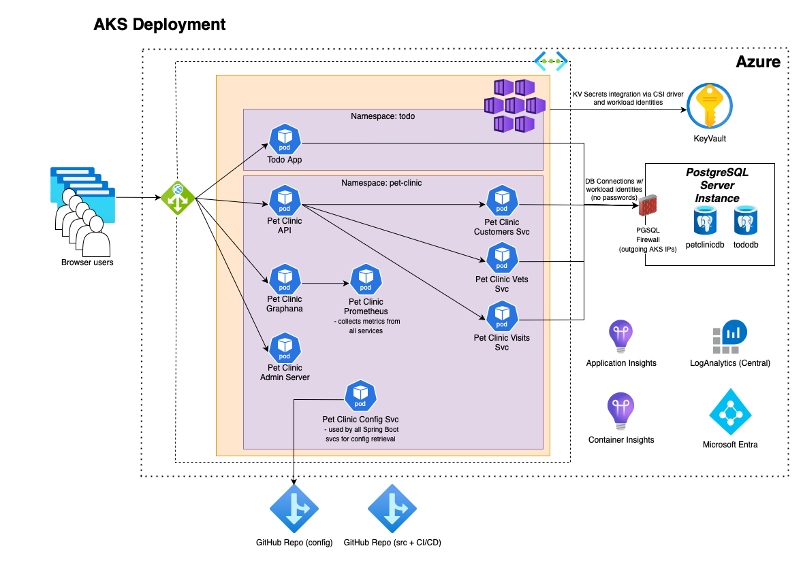

# Spring Boot Todo App and Pet Clinic App on Azure Kubernetes Service (AKS)

## Deploying Todo App and Pet Clinic App into an AKS using Github actions (CI/CD Pipeline)



* Copy [this](https://github.com/martinabrle/aks-java-demo) repo's content into your personal or organizational GitHub Account
* Copy pet clinic app's config repo content from [this](https://github.com/martinabrle/aks-java-demo-config) repo into your personal or organizational GitHub Account
* *Note: This limited example is not utilising GitHub->Settings->Environments. It would make sense to have separated DEVE, TEST, UAT and PRODUCTION environments*
* Click on *GitHub->Settings->Secrets and variables->Actions->Secrets* and set the following GitHub action secrets:
```
AAD_TENANT_ID
AKS_ADMIN_GROUP_NAME
AKS_NAME
AKS_RESOURCE_GROUP
AKS_SUBSCRIPTION_ID
AZURE_LOCATION (example value: eastus)
CONTAINER_REGISTRY_NAME
CONTAINER_REGISTRY_RESOURCE_GROUP (if omitted, the value of AKS_RESOURCE_GROUP will be used)
CONTAINER_REGISTRY_SUBSCRIPTION_ID (if omitted, the value of AKS_SUBSCRIPTION_ID will be used)
DBA_GROUP_NAME
LOG_ANALYTICS_WRKSPC_NAME
LOG_ANALYTICS_WRKSPC_RESOURCE_GROUP (if omitted, the value of AKS_RESOURCE_GROUP will be used)
LOG_ANALYTICS_WRKSPC_SUBSCRIPTION_ID (if omitted, the value of AKS_SUBSCRIPTION_ID will be used)
PET_CLINIC_APP_EDIT_AD_GROUP_NAME
PET_CLINIC_APP_VIEW_AD_GROUP_NAME
PET_CLINIC_CUSTS_SVC_DB_USER_NAME
PET_CLINIC_DB_NAME
PET_CLINIC_GIT_CONFIG_REPO_PASSWORD (this is the token for the pet clinic app's config repo)
PET_CLINIC_GIT_CONFIG_REPO_URI
PET_CLINIC_GIT_CONFIG_REPO_USERNAME
PET_CLINIC_VETS_SVC_DB_USER_NAME
PET_CLINIC_VISITS_SVC_DB_USER_NAME
PGSQL_NAME
PGSQL_RESOURCE_GROUP (if omitted, the value of AKS_RESOURCE_GROUP will be used)
PGSQL_SUBSCRIPTION_ID (if omitted, the value of AKS_SUBSCRIPTION_ID will be used)
TODO_APP_DB_NAME
TODO_APP_DB_USER_NAME
TODO_APP_EDIT_AD_GROUP_NAME
TODO_APP_VIEW_AD_GROUP_NAME
```

* Click on *GitHub->Settings->Secrets and variables->Actions->Variables* and set the following GitHub action variables:
```
AKS_RESOURCE_TAGS (example value: { \"Department\": \"RESEARCH\", \"CostCentre\": \"DEV\", \"DeleteNightly\": \"true\", \"Architecture\": \"AKS\"} )
CONTAINER_REGISTRY_RESOURCE_TAGS
LOG_ANALYTICS_WRKSPC_RESOURCE_TAGS
PET_CLINIC_GIT_CONFIG_REPO_URI
PGSQL_RESOURCE_TAGS
```

* Register a Microsoft Entra application in Azure and add federated credentials in order for GitHub actions to deploy resources into Azure ([link](https://learn.microsoft.com/en-us/azure/developer/github/connect-from-azure?tabs=azure-cli%2Cwindows#use-the-azure-login-action-with-openid-connect)). You will need to assign *Key Vault Administrator*, *Contributor* and *Owner* role to the newly created SP for every subscription you are deploying into. The service principal will also need to have "Directory.Read" role assigned to it for the workflow to work.
```
az ad sp create-for-rbac --name {YOUR_DEPLOYMENT_PRINCIPAL_NAME} --role "Key Vault Administrator" --scopes /subscriptions/{AZURE_SUBSCRIPTION_ID} --sdk-auth
az ad sp create-for-rbac --name {YOUR_DEPLOYMENT_PRINCIPAL_NAME} --role contributor --scopes /subscriptions/{AZURE_SUBSCRIPTION_ID} --sdk-auth
az ad sp create-for-rbac --name {YOUR_DEPLOYMENT_PRINCIPAL_NAME} --role owner --scopes /subscriptions/{AZURE_SUBSCRIPTION_ID} --sdk-auth
```
* Copy the *clientId* value into a newly created *AAD_CLIENT_ID* repo secret
* Run the infrastructure deployment by running *Actions->98-Infra* manually; this action is defined in ```./aks-java-demo/.github/workflows/98-infra.yml```
* Generate releases for all apps and microservices by running *Actions->70-continuous-integration-delivery.yml* manually; this action is defined in ```./aks-java-demo/.github/workflows/70-continuous-integration-delivery.yml```
* Open the apps' URLs - to be found in App Gateway (```https://${TODO}.TODO/```) - in the browser and test it by creating and reviewing tasks in the todo app and by adding and reviewing vets and visits in the pet clinic app
* Delete created resources by deleting all newly created resource groups from Azure Portal. This will remove resources created.
